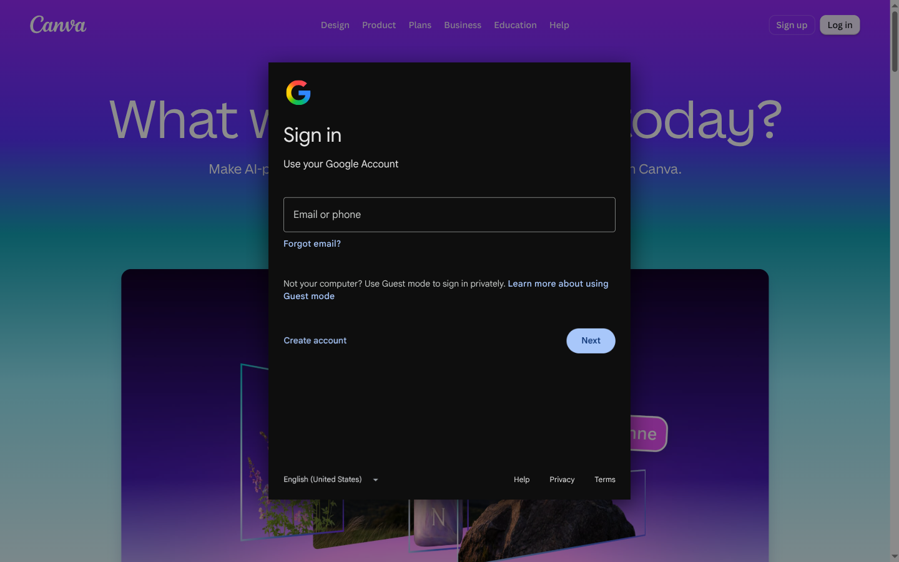
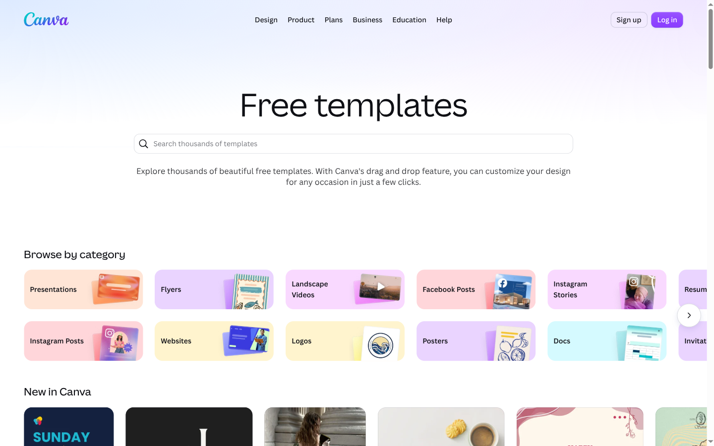

# Canva for Linux

Canva in its own desktop window, without a browser around it. Everything you open in Canva stays in that one window, instead of scattering new browser windows the way a web app shortcut does.

It runs on the Electron package from your distribution, natively on Wayland, so there is nothing to build. Made for Arch and [Omarchy](https://omarchy.org), and forked from [vikdevelop/canvadesktop](https://github.com/vikdevelop/canvadesktop).


## Contents

- [Install](#install)
- [Using Canva](#using-canva)
- [Keyboard shortcuts](#keyboard-shortcuts)
- [Hyprland and Omarchy setup](#hyprland-and-omarchy-setup)
- [Troubleshooting](#troubleshooting)
- [Uninstall](#uninstall)
- [Development](#development)

## Install

1. Make sure an Electron package (`electron41`, `electron43` and so on) is installed:

   ```bash
   ls /usr/bin/electron*
   ```

   If nothing is listed, install one. On Omarchy: `omarchy pkg add electron`. On Arch: `sudo pacman -S electron`.

2. Clone this repository and run the installer:

   ```bash
   git clone https://github.com/ctrts/canva-linux.git
   cd canva-linux
   ./install.sh
   ```

The installer copies the app to `~/.local/share/canva-linux` and adds a `canva` command to `~/.local/bin`. It also adds Canva to your app launcher and registers the app for `canva://` links. If you had a Canva web app from Omarchy's web app installer, it is set aside as `Canva.desktop.webapp.bak` and comes back if you uninstall.

To update later, run `git pull` and then `./install.sh` again.

## Using Canva

Open Canva from your app launcher, or run `canva` in a terminal. You can also pass a Canva link: `canva https://www.canva.com/design/...`.

### Signing in

Click **Log in** and choose how to sign in. Google, Apple, Facebook and Microsoft sign-in open in a small pop-up window. The pop-up closes itself once you're signed in, and you stay signed in the next time you open Canva.



### One window

- Designs, templates and other Canva pages open in the Canva window, even when Canva would normally open a new tab.
- Links to other websites open in your default browser.
- Opening Canva again (from the launcher, the `canva` command or a link) brings the existing window forward instead of starting a second copy.



### "Open in the desktop app" links

If your Canva account is set to open links in the desktop app, Canva will try to hand pages over to its official desktop app, which doesn't exist on Linux. This app skips that step and carries on in its own window.

`canva://` links from other apps (email, chat, your browser) open here too.

### Downloads

When you download or export a design, it saves straight to your `~/Downloads` folder without asking where to put it. If a file with the same name already exists, ` (1)`, ` (2)` and so on is added, so nothing is overwritten. A notification shows the file name; click it to open the folder.


## Keyboard shortcuts

There is no menu bar. Canva's own shortcuts all work, including Ctrl+Plus and Ctrl+Minus to zoom a design. The app adds these:

| Shortcut | Action |
|---|---|
| Alt+Left | Back |
| Alt+Right | Forward |
| F5 or Ctrl+R | Reload the page |
| Ctrl+Shift+R | Reload, ignoring the cache |
| F12 or Ctrl+Shift+I | Developer tools |

## Hyprland and Omarchy setup

These are optional. Add them to your Hyprland config (on Omarchy, `~/.config/hypr/hyprland.lua` and `~/.config/hypr/bindings.lua`).

Float the sign-in pop-up over Canva instead of tiling it:

```lua
o.window({ class = "^canva$", title = "^Canva sign-in$" }, { float = true, center = true, size = { 580, 720 } })
```

Open Canva, or jump to it if it's already open, with Super+Alt+C:

```lua
o.bind("SUPER + ALT + C", "Canva", "omarchy-launch-or-focus '^canva$' canva")
```

Check the key is free first with `omarchy menu keybindings --print`.

## Troubleshooting

**Canva doesn't start.** Run `canva` in a terminal to see the error. "No electron found" means the Electron package is missing (see [Install](#install)). Electron is often installed only because another app needs it, such as Obsidian, so uninstalling that app can remove it. To keep it, mark it as installed on purpose: `sudo pacman -D --asexplicit electron43`.

**A blank page after signing in.** Close Canva, open it again, and sign in once more. If it keeps happening, run it with logging (below) and open an issue with the output.

**Something opens in the browser instead of Canva.** Run Canva with logging to see which link was sent where:

```bash
CANVA_DEBUG=1 canva
```

This prints every new window request, page change and permission request to the terminal.

**Start over with a clean sign-in.** Close Canva and delete `~/.config/Canva`.

## Uninstall

```bash
./uninstall.sh          # removes the app, keeps your sign-in in ~/.config/Canva
./uninstall.sh --purge  # also deletes the sign-in data
```

Uninstalling also removes the `canva://` link handler and restores an Omarchy Canva web app if the installer set one aside. Hyprland rules and bindings you added yourself stay in your config.

## Development

Run the copy in this repository instead of the installed one:

```bash
npm start
```

The whole app is `src/main/main.js`. It decides where each new window goes (`routeNewWindow`), skips the desktop-app handoff and saves downloads. Set `CANVA_DEBUG=1` to log its decisions.

## License

MIT. See [LICENSE](LICENSE).
